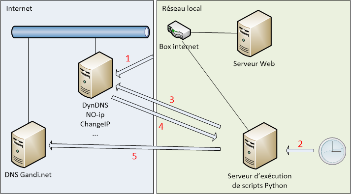

# DnsUpdater

_Read this in [English](README.md)._

Le script _dns_updater.py_ permet la mise à jour de l'enregistrement A sur un DNS [Gandi](https://www.gandi.net). Son utilisation peut être nécessaire lorsque vous hébergez un serveur derrière une box internet et que celle-ci possède une adresse IP publique dynamique alors que vous souhaitez utiliser un nom de domaine hébergé chez [Gandi](https://www.gandi.net). C'est le cas par exemple en France avec le fournisseur d'accès Internet [Orange](https://www.orange.fr)/[Sosh](https://www.sosh.fr).

## Prérequis

Pour fonctionner correctement, _dns_updater.py_ nécessite un certain nombre de prérequis. Le choix des fournisseurs est laissé à votre choix. Une exception concerne l'hébergeur du nom de domaine qui ne peut être que [Gandi](https://www.gandi.net), le script utilisant un appel d'API REST dont le format n'est valable pour le moment que chez [Gandi](https://www.gandi.net).

Voici la liste des prérequis:

- Un fournisseur d'accès à Internet avec une box Internet qui permet la configuration et l'utilisation de services de DNS dynamiques ([NO-ip](https://www.noip.com/), [DynDNS](http://www.dyndns.fr/), [ChangeIP](https://www.changeip.com/), ...),
- Un service de DNS dynamique accepté par la box Internet,
- Un nom de domaine hébergé chez [Gandi](https://www.gandi.net),
- Un serveur local à votre réseau offrant des services web/mail/ftp/...,
- Un serveur (qui peut-être le même) permettant l'exécution de scripts Python en version 3.

## Architecture

Voici un petit diagramme représentant l'architecture qui sera mise en place:



Quelques explications s'imposent sur l'enchaînement des différentes étapes:

1. Lorsque l'adresse IP de la box change, celle-ci prévient le service de DNS dynamique afin que la nouvelle IP soit associée aux noms de domaine dynamiques,
2. Un ordonnanceur (par exemple crontab) déclenche l'exécution du script _dns_updater.py_,
3. Le script interroge indirectement le serveur de noms du service d'IP dynamique (en fait c'est le serveur DNS qu'utilise le serveur d'exécution de scripts Python, par exemple celui de votre FAI),
4. Le script récupère l'adresse IP associée au nom de domaine dynamique. Si cette IP est différente de la dernière récupération, l'enchaînement se fait sur l'étape 5, sinon se termine immédiatement,
5. Le script met à jour l'adresse IP dans l'enregistrement A du nom de domaine hébergé chez [Gandi](https://www.gandi.net).

## Installation

Pour fonctionner, ce script nécessite un ordinateur avec Python 3 installé. Il est testé et fonctionne sur Windows et Linux Debian.

Il nécessite les modules Python suivants:

- os
- sys
- socket
- pathlib
- configparser
- requests
- json
- datetime
- logging

Si un module est manquant, il est nécessaire de l'installer au moyen de la commande: _pip3 install <nom_module>_

## Configuration

### Paramétrage

Lors du lancement du script pour la première fois, un fichier de configuration minimaliste _dns_updater.ini_ est créé dans le même répertoire que le script. Ce fichier est de la forme:

```
[General]
version=1
#ddnsHostname=DYNAMIC_DNS_HOST
ip=

[Reports]
logFile=dns_updater.log
logFileWhen=midnight
logFileInterval=3600
logFileBackupCount=10

[Gandi]
#apikey=YOUR_GANDI_API_KEY
livednsRecordUrl=https://api.gandi.net/v5/livedns/domains/{host}/records/%%40/A
hosts=YOUR_HOSTS_SEPARATED_BY_COMMA
```

Le script se terminera alors et s'arrêtera à chaque fois tant que les paramètres obligatoires n'auront pas été valorisés et décommentés

| Section | Paramètre          | Obligatoire | Description                                                                                                                                                                                            |
| ------- | ------------------ | ----------- | ------------------------------------------------------------------------------------------------------------------------------------------------------------------------------------------------------ |
| General | version            | oui         | Version du script pour ce fichier INI.                                                                                                                                                                 |
| General | ip                 | non         | Sera valorisé automatiquement au premier lancement lorsque les paramètres obligatoires auront été renseignés                                                                                           |
| General | ddnsHostname       | oui         | Le nom de domaine hébergé dans le service de domaine dynamique (par exemple: monsite.ddns.net)                                                                                                         |
| Reports | logFile            | non         | Chemin du fichier pour les logs.                                                                                                                                                                       |
| Reports | logFileWhen        | non         | Indique quand faire la rotation du fichier. Les valeurs possibles sont: S (secondes), M (minutes), H (heures), D (jours), midnight (rotation à minuit) W{0-6} (jours de la semaine avec 0 pour lundi). |
| Reports | logFileInterval    | non         | L'interval de secondes, minutes, jours, ....                                                                                                                                                           |
| Reports | logFileBackupCount | non         | Nombre d'historiques à garder.                                                                                                                                                                         |
| Gandi   | apikey             | oui         | La clé API REST de Gandi. Reportez-vous à la page https://docs.gandi.net/en/domain_names/advanced_users/api.html                                                                                       |
| Gandi   | livednsRecordUrl   | oui         | URL d'appel au service de mise à jour de l'enregistrement A chez Gandi. Normalement on n'y touche pas sans savoir ce que l'on fait                                                                     |
| Gandi   | hosts              | oui         | La liste des noms de domaines chez Gandi séparés par des virgules (par exemple: monsite1.org,monsite2.net,monsite3.fr). Il ne doit y avoir aucun espace.                                               |

### Droits

Etant donné l'aspect sensible du script et de sa configuration, il est recommandé de ne donner les droits d'exécution et de modification du script qu'à un administrateur. Sous Linux, cela se fait ainsi:

```
chown root:root dns_updater.py
chmod 744 dns_updater.py
chown root:root dns_updater.ini
chmod 600 dns_updater.ini
```

Sous Windows ou les autres OS, reportez-vous à sa documentation pour savoir comment modifier ces droits.

### Ordonnancement

L'ordonnancement sous Linux se fait avec _crontab_. Voici comment configurer l'exécution du script toutes les 5 minutes. On va supposer que le script se trouve à cet endroit: /opt/DnsUpdater/dns_updater.py. Pour modifier crontab pour l'administrateur, faites ceci:

```
sudo crontab -e
```

Dans l'éditeur qui s'affiche, ajoutez la ligne:

```
*/5 * * * * python3 /opt/DnsUpdater/dns_updater.py > /dev/null 2>&1
```

## Bugs et évolutions

Vous pouvez signaler tout bug éventuel ou demander des évolutions et nouvelles fonctionnalités au moyen du gestionnaire d'_issue_ de GitHub: https://github.com/stefv/DnsUpdater/issues
