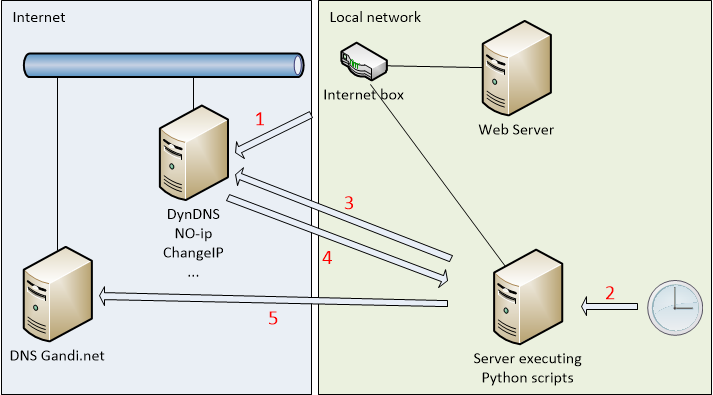

# DnsUpdater

_Lire ceci en [Français](README.fr.md)._

The _dns_updater.py_ script is used to update the A record on a [Gandi](https://www.gandi.net) DNS. Its use may be necessary when you host a server behind an internet box and this one has a dynamic public IP address while you wish to use a domain name hosted by [Gandi](https://www.gandi.net). This is the case for example in France with the Internet service provider [Orange](https://www.orange.fr)/[Sosh](https://www.sosh.fr).

## Prerequisite

To function properly, _dns_updater.py_ requires a number of prerequisites. The choice of suppliers is left to your choice. An exception concerns the host of the domain name which can only be [Gandi](https://www.gandi.net), the script is using a REST API call whose format is currently only valid at [Gandi](https://www.gandi.net).

Here is the list of prerequisites::

- An Internet service provider with an Internet box that allows the configuration and use of dynamic DNS services ([NO-ip](https://www.noip.com/), [DynDNS](http://www.dyndns.fr/), [ChangeIP](https://www.changeip.com/), ...),
- A dynamic DNS service accepted by the Internet box,
- A domain name hosted by [Gandi](https://www.gandi.net),
- A server local to your network offering services like web/mail/ftp/...,
- A server (which maybe the same) allowing the execution of Python scripts in version 3.

## Architecture

Here is a small diagram representing the architecture that will be implemented:



Some explanations are needed on the sequence of the different stages:

1. When the IP address of the box changes, it warns the dynamic DNS service so that the new IP is associated with dynamic domain names,
2. A scheduler (for example crontab) triggers the execution of the script _dns_updater.py_,
3. The script indirectly queries the dynamic IP service name server (in fact it is the DNS server that the Python scripting server uses, for example that of your ISP),
4. The script retrieves the IP address associated with the dynamic domain name. If this IP is different from the last retrieval, the sequence is done on step 5, otherwise ends immediately,
5. The script updates the IP address in the A record of the domain name hosted by [Gandi](https://www.gandi.net).

## Installation

To work, this script requires a server with Python 3 installed. It is tested and works on Windows and Linux Debian.

It requires the following Python modules:

- os
- sys
- socket
- pathlib
- configparser
- requests
- json
- datetime

If a module is missing, it must be installed using the command: pip3 install <module_name>

## Configuration

### Settings

When launching the script for the first time, a minimalist _dns_updater.ini_ configuration file is created in the same directory as the script. This file is of the form:

```
[General]
version=1
#ddnsHostname=DYNAMIC_DNS_HOST
ip=

[Gandi]
#apikey=YOUR_GANDI_API_KEY
livednsRecordUrl=https://api.gandi.net/v5/livedns/domains/{host}/records/%%40/A
hosts=YOUR_HOSTS_SEPARATED_BY_COMMA
```

The script will then end and stop each time as long as the mandatory parameters have not been valued and uncommented.

| Section | Setting          | Mandatory | Description                                                                                                                         |
| ------- | ---------------- | --------- | ----------------------------------------------------------------------------------------------------------------------------------- |
| General | version          | yes       | Version of the script for this INI file. |
| General | ip               | no        | Will be automatically valued at the first launch when the mandatory parameters have been setted                                     |
| General | ddnsHostname     | yes       | The name of the domain hosted in the dynamic domain service (for example: mysite.ddns.net)                                          |
| Gandi   | apikey           | yes       | Gandi's REST API key. Refer to page https://docs.gandi.net/en/domain_names/advanced_users/api.html                                  |
| Gandi   | livednsRecordUrl | yes       | URL for calling the A record update service at Gandi. Normally we don't touch it without knowing what we're doing                   |
| Gandi   | hosts            | yes       | The list of domain names at Gandi separated by commas (for example: mysite1.org,mysite2.net,mysite3.com). There should be no space. |

### Rights

Given the sensitive aspect of the script and its configuration, it is recommended that you only give the execution and modification rights of the script to an administrator. In Linux, this is done as follows:

```
chown root:root dns_updater.py
chmod 744 dns_updater.py
chown root:root dns_updater.ini
chmod 600 dns_updater.ini
```

On Windows or other OS, refer to its documentation to learn how to modify these rights.

### Scheduling

The scheduling under Linux is done with _crontab_. Here's how to configure the script to run every 5 minutes. We will assume that the script is at this location: /opt/DnsUpdater/dns_updater.py. To modify crontab for the administrator, do this:

```
sudo crontab -e
```

In the editor that appears, add the line:

```
*/5 * * * * python3 /opt/DnsUpdater/dns_updater.py > /dev/null 2>&1
```

## Bugs & new features

You can report any bugs or request changes and new features using the GitHub's _issue_ manager: https://github.com/stefv/DnsUpdater/issues
